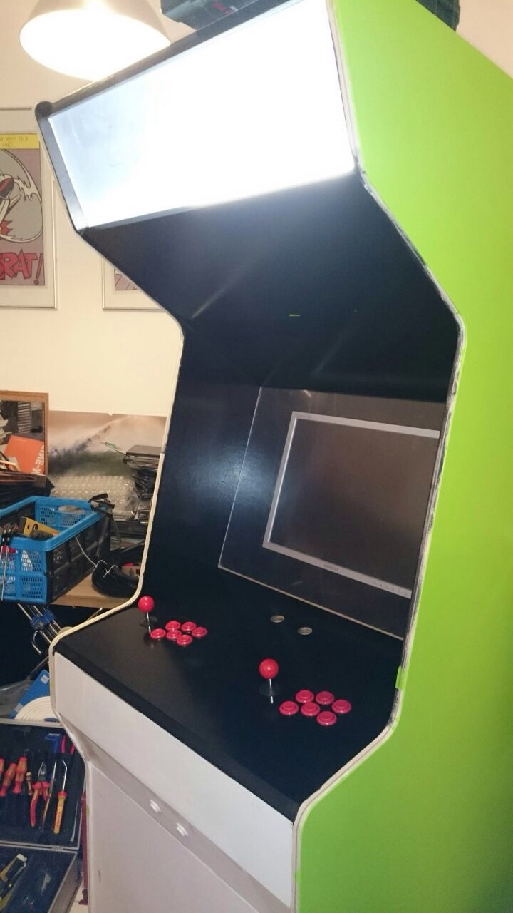

# samus-arcade.provisioning
Ansible all afternoon

## Testing with Vagrant
Initial setup:
```
vagrant up --provision
```

Connect to box:
```
vagrant ssh
```

Stops and delets box:
```
vagrant destroy
```


